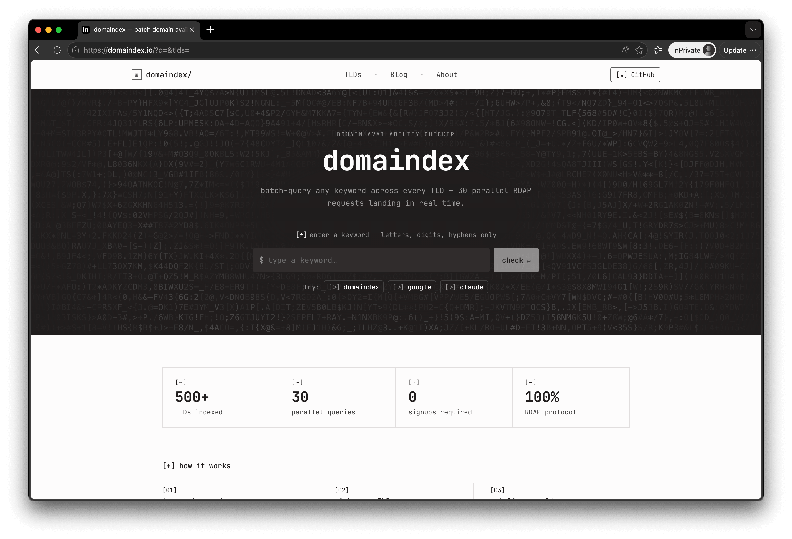

<div align="center">
  

  <h1>domaindex — Bulk Domain Availability Checker</h1>

  <p>Type a keyword. Check availability across 100+ TLDs in real time — powered by RDAP, no signup required.</p>

  [](https://domaindex.io)
  [](https://domaindex.io/tlds)
  [](https://domaindex.io)

  [English](./README.md) · [中文](./README.zh.md)
</div>

<br />

<div align="center">
  
</div>

<br />

## What is domaindex?

**[domaindex.io](https://domaindex.io)** is a free bulk domain availability checker. Enter any keyword — a brand name, project slug, or personal handle — and instantly see which extensions are available across **100+ TLDs simultaneously**.

Unlike WHOIS tools that check one domain at a time, domaindex fires up to **30 parallel RDAP queries** and streams results back as each registry responds. You see available domains appear in real time, without waiting for the slowest registry to finish.

```
Keyword: acme

acme.com    → taken     (registered 1995-04-28)
acme.io     → available ✓
acme.ai     → taken
acme.app    → available ✓
acme.dev    → available ✓
acme.co     → taken
...
```

## ✨ Features

**⚡ Parallel search across 100+ TLDs**
Check `.com`, `.net`, `.org`, `.io`, `.ai`, `.app`, `.dev`, `.co`, `.me` and 100+ more in a single search — all at once, not one by one.

**📡 Real-time results via RDAP**
Results stream in as each registry responds. No waiting for the full list to load — fast registries appear in seconds.

**🔗 Shareable search URLs**
Your keyword and TLD selection are encoded in the URL. Share the link and teammates land on the exact same search instantly.

**🎛️ Custom TLD sets**
Pick only the extensions you care about. Preferences save in your browser automatically — no account needed.

**🛒 One-click registrar links**
Available domains show direct purchase links to Namecheap, Porkbun, and GoDaddy. No copy-pasting.

**📋 Domain detail panel**
Click any result to see registration date, expiry date, registrar, and nameservers — pulled from live RDAP data.

**🔒 Zero friction**
No signup. No email. No tracking. Just type a keyword and go.

## 🎯 Who Is It For?

| Who | Why they use domaindex |
|---|---|
| **Founders & entrepreneurs** | Find a `.com`, `.io`, or `.ai` for a startup before competitors do |
| **Indie developers** | Check if a project name is free across every major extension at once |
| **Domain investors** | Scan a keyword across dozens of TLDs in seconds |
| **Agencies** | Run live availability checks during naming sprints |
| **Anyone checking domains one by one** | There's a faster way |

## ❓ FAQ

**What is a bulk domain availability checker?**
A bulk domain availability checker searches whether multiple domain names are registered or free — simultaneously. Instead of checking `mybrand.com`, then `mybrand.io`, then `mybrand.ai` one by one, domaindex queries all of them in parallel and shows results as they arrive.

**What is RDAP, and how is it different from WHOIS?**
RDAP (Registration Data Access Protocol) is the modern successor to WHOIS. It returns structured JSON rather than plain text, making lookups faster, more reliable, and less prone to rate-limiting issues. domaindex uses RDAP for all availability queries — no scraping, no guessing.

**How many TLDs does domaindex support?**
domaindex supports **100+ TLDs**, including popular gTLDs (`.com`, `.net`, `.org`, `.io`, `.ai`, `.app`, `.dev`), ccTLDs (`.co`, `.me`, `.so`, `.uk`), and new generic TLDs. Browse the full supported list at [domaindex.io/tlds](https://domaindex.io/tlds).

**Is domaindex free to use?**
Yes. The domain availability checker is completely free with no signup required. Advanced features (saved projects, API access, and more) are available on paid plans — see [domaindex.io/pricing](https://domaindex.io/pricing).

**How accurate is the availability data?**
domaindex queries each TLD's authoritative RDAP registry directly, so data is as fresh and accurate as the registry allows. Some ccTLDs do not publish RDAP endpoints and may not return results.

**Can I share a search with my team?**
Yes — your keyword and TLD selection are always in the URL. Copy it and paste it anywhere. The recipient lands on the identical search with no account or app required.

## 🔗 Links

- 🌍 **Try it free**: [domaindex.io](https://domaindex.io)
- 📖 **Browse TLDs**: [domaindex.io/tlds](https://domaindex.io/tlds)
- 💰 **Pricing**: [domaindex.io/pricing](https://domaindex.io/pricing)
- 🗺️ **Roadmap**: [domaindex.io/roadmap](https://domaindex.io/roadmap)
- 📝 **Blog**: [domaindex.io/blog](https://domaindex.io/blog)
- 🐦 **Twitter / X**: [@ruguodev](https://x.com/ruguodev)

---

© 2025 domaindex · All Rights Reserved · [domaindex.io](https://domaindex.io)
